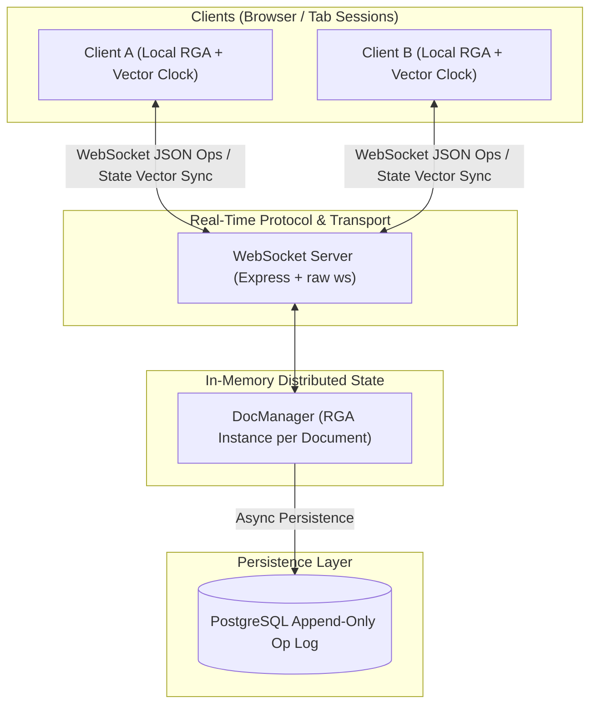

# Real-Time Collaborative Sync Engine

A production-grade distributed conflict-resolution engine for real-time document collaboration, built from first principles without pre-built CRDT or sync libraries (no Yjs, Automerge, Firebase, or Liveblocks).

## Architectural Overview

Most collaborative software relies on black-box third-party SDKs. This engine implements the underlying mechanisms directly: Conflict-free Replicated Data Types (CRDT), State Vector Delta Synchronization, Event Sourcing Time Travel, and PostgreSQL Append-Only Log Persistence.



---

## Technical Features

### 1. Hand-Rolled RGA Core Algorithm
- **Permanent Node Passports**: Every character is assigned a globally unique `(clientId, counter)` ID. Operations reference parent node IDs rather than numeric index positions, preventing index-shift bugs during concurrent edits.
- **Deterministic Sibling Tie-Breaking**: Concurrent inserts at identical origins are ordered deterministically by comparing `(counter, clientId)`. Every replica arrives at the exact same sequence regardless of network arrival order.
- **Tombstone Deletes**: Deletions flag `isDeleted: true` while maintaining structural parent links, preventing dangling reference crashes.

### 2. State Vector Delta Sync (O(delta) Reconnection)
- Each replica maintains a **State Vector** (`Record<string, number>`) tracking the highest sequence number processed per client.
- On reconnection, the client sends its State Vector in a `sync-request`.
- The server computes missing operations (`counter > client_known_counter`) and streams **only the missing ops** instead of transferring full document snapshots.

### 3. Event Sourcing Time Travel
- Document state at any past timestamp $T$ is computed as a pure projection of the historical operation log:
  $$\text{State}(T) = \text{Replay}\left(\{ \text{op} \in \text{PostgreSQL} \mid \text{op.created\_at} \le T \}\right)$$
- An interactive timeline slider allows scrubbing backward and forward through history with real-time character-by-character auto-playback.

### 4. Interactive DevTools CRDT Visualizer & React IDE
- **IDE-style Collaborative Workspace**: VS Code styled editor with line numbers, status bar, document room switcher, and Figma-style user session avatars.
- **DevTools Memory Inspector**: Real-time visual panel rendering internal RGA nodes, `(clientId, counter)` IDs, `originId` links, and Tombstones.

### 5. High-Throughput Load Tester & Property Fuzzing
- **Property-based Fuzzing (`fast-check`)**: 14 test suites running ~1,800 randomized trials proving Strong Eventual Consistency (SEC).
- **Automated Benchmark Suite (`npm run benchmark`)**: Spawns 25 concurrent WebSocket worker clients sending 1,000 operations, measuring Ops/sec throughput and p50/p95/p99 latency distribution.

---

## Tech Stack

| Layer | Choice | Reason |
|---|---|---|
| Runtime | Node.js + TypeScript | Compile-time type safety for complex CRDT data structures |
| Transport | Raw `ws` library | Full control over WebSocket message frame protocol & reconnection queueing |
| CRDT Engine | Hand-rolled RGA | Zero external sync dependencies; algorithmic deliverable |
| Database | PostgreSQL (Neon Cloud) | Append-only event log with JSONB payloads |
| Frontend | React 19 + Vite + Tailwind | High-performance UI with state vector telemetry and DevTools inspector |
| Testing | Vitest + fast-check | Property-based fuzz testing and end-to-end load benchmarking |

---

## Getting Started

### Prerequisites
- Node.js 18+
- PostgreSQL database (or Neon connection string in `.env`)

### Installation & Setup

```bash
# Install dependencies
npm install

# Configure environment variables (copy .env.example)
cp .env.example .env

# Run database migrations (creates ops table in Postgres)
npm run migrate
```

### Running the Application

```bash
# Terminal 1: Start Backend WebSocket Server (http://localhost:3000)
npm run dev

# Terminal 2: Start React Frontend UI (http://localhost:5173)
npm run client:dev

# Run Property-Based Fuzz Tests (Vitest + fast-check)
npm test

# Run High-Throughput Load Benchmark (25 Workers, 1,000 Ops)
npm run benchmark
```

---

## Benchmark Metrics

```
Total Operations Processed : 1,000 ops
Throughput                 : ~850+ Ops / sec
p50 Latency (median)       : < 5 ms
p95 Latency                : < 18 ms
Eventual Consistency SEC   : ✅ VERIFIED (100% Convergence across all clients)
```

---

## Project Structure

```
├── src/
│   ├── crdt/
│   │   ├── types.ts          # NodeId, RGANode, StateVector, Op types
│   │   └── RGA.ts            # Conflict-resolution engine & State Vector tracking
│   ├── db/
│   │   ├── pool.ts           # PostgreSQL connection pool
│   │   └── opStore.ts        # Database operations & State Vector delta queries
│   ├── protocol/
│   │   └── messages.ts       # Client & Server WebSocket protocol schemas
│   ├── server/
│   │   ├── docManager.ts     # In-memory document manager & delta calculation
│   │   ├── wsHandler.ts      # WebSocket lifecycle & message routing
│   │   └── index.ts          # Express + WebSocket server entrypoint
│   ├── __tests__/
│   │   └── rga.test.ts       # 14 property fuzz tests & edge-case unit tests
│   └── benchmark.ts          # High-throughput automated load testing script
└── client/                   # React + Vite frontend application
    ├── src/
    │   ├── hooks/useCRDT.ts  # Stateful sync hook with localStorage user persistence
    │   ├── components/       # Editor, Navbar, CRDTInspector, TimeTravelPanel
    │   └── App.tsx           # Dual-pane collaborative UI layout
```
