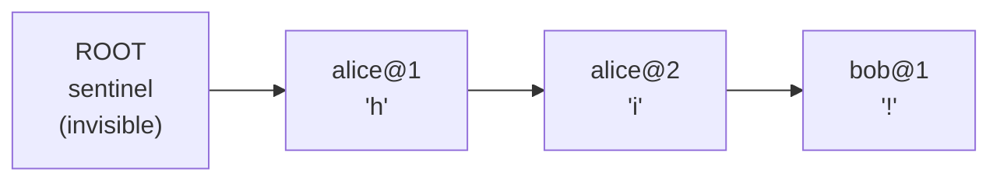
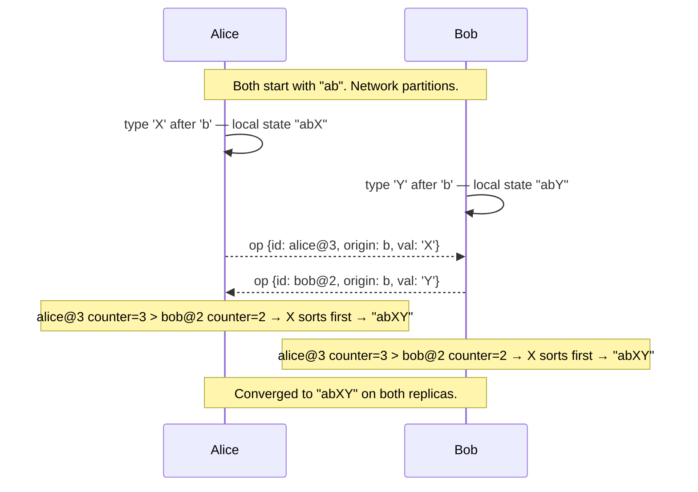
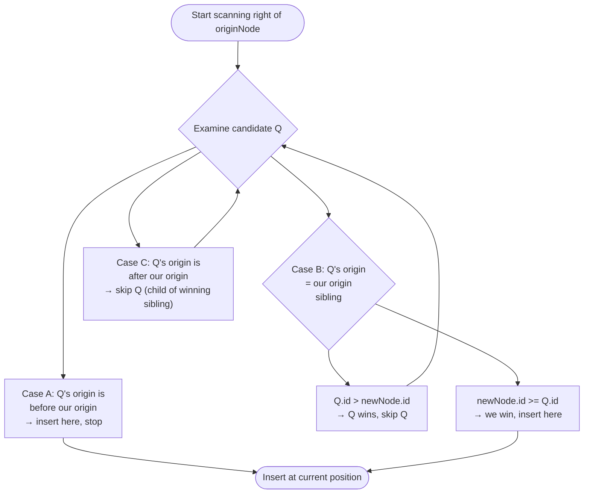

# Real-Time Collaborative Sync Engine

A conflict-resolution engine for concurrent document editing, implemented from scratch without any pre-built CRDT or sync libraries.

## Overview

Most developers interact with collaborative editing as a black box — Firebase, Liveblocks, Yjs. This project implements the underlying mechanism directly: how do multiple clients edit the same document simultaneously and always converge to an identical result, even when network packets arrive out of order or a client reconnects after being offline?

The core is an **RGA (Replicated Growable Array)** — a type of CRDT (Conflict-free Replicated Data Type). Every character is given a permanent unique identity rather than a positional index. Concurrent edits at the same position are resolved by a deterministic tie-break rule that every replica computes identically, regardless of which message arrived first. The result is strong eventual consistency with no central locking, no turn-taking, and no data loss on reconnect.

## How the Algorithm Works

### Node Structure

Each character in the document is a node with three fields:

| Field | Type | Purpose |
|---|---|---|
| `id` | `(clientId, counter)` | Permanent unique identity — never shifts when other edits happen |
| `originId` | `NodeId \| null` | The node this was inserted *after* — a stable anchor, not a position number |
| `isDeleted` | `boolean` | Tombstone flag — deleted nodes stay in the list so future inserts can still reference them |

### Document as an Ordered List



`toString()` walks the list and skips tombstones. The rendered output is `"hi!"`.

### Concurrent Insert Resolution

When two clients insert after the same node simultaneously, both ops carry the same `originId`. Without a rule, replicas could order them differently and diverge.

**Tie-break rule:** higher `counter` wins. On a tie, lexicographically later `clientId` wins. Every replica applies this same rule — guaranteed identical output regardless of arrival order.



### Insert Position Algorithm

When inserting a new node after its `originNode`, the algorithm scans right through the list:



### Out-of-Order Delivery

If an op's `originId` has not arrived yet, the op is parked in a pending buffer and retried after every successful insert. This handles flaky networks and offline reconnects without crashes or duplicates.

## Tech Stack

| Layer | Choice | Reason |
|---|---|---|
| Runtime | Node.js + TypeScript | TypeScript catches ID and field mismatches in CRDT logic at compile time |
| Real-time | Raw `ws` library | Full protocol control; Socket.IO abstractions conflict with custom reconnect logic |
| CRDT core | Hand-written, zero dependencies | The algorithm is the deliverable |
| Persistence | PostgreSQL | Append-only op log with JSONB payload; time-travel revert is a timestamp-filtered replay |
| Client | React + native WebSocket API | Minimal global state — a few hooks are sufficient |
| Testing | Vitest + fast-check | Property-based fuzz testing generates randomized op sequences to prove SEC empirically |

## Tests

14 tests across two categories.

**Unit tests** — every documented edge case:
- Sequential inserts build correct document order
- Tombstone hides a deleted node without removing it
- Duplicate insert and duplicate delete are both no-ops (idempotency)
- Out-of-order delivery via pending buffer (C arrives before B before A — resolves to ABC)
- Delete arrives before its insert — character is never visible
- Concurrent tie-break by `clientId` and by `counter`
- Child of a winning sibling stays grouped with its parent (Case C)

**Property-based fuzz tests** — convergence proof:

Each test runs 300–500 randomised trials. fast-check generates op sets and delivery permutations automatically and shrinks any failure to a minimal reproducing case.

| Property test | What it stresses |
|---|---|
| Concurrent inserts at same position | Maximum sibling conflict |
| Sequential causal chain | Out-of-order delivery of dependent ops |
| Multi-client realistic collaboration | 4 clients, mixed concurrent and sequential edits |
| Mixed inserts and deletes | Deletes arriving before their inserts |
| Concurrent delete of an insert | The intent-preservation edge case |

```bash
npm test
# 14 tests, ~1800 total fuzz trials, ~90ms
```

## Running

```bash
npm install
npm run demo   # smoke test — three manual scenarios, no server needed
npm test       # full test suite
```

## Project Structure

```
src/
  crdt/
    types.ts          NodeId, RGANode, InsertOp, DeleteOp
    RGA.ts            conflict-resolution engine
  __tests__/
    rga.test.ts       unit + property-based convergence tests
  demo.ts             manual scenario runner
```

## Known Limitation

The intent-preservation problem is an open research issue in CRDTs. If a client goes offline and inserts text inside a paragraph while another client concurrently deletes that entire paragraph, the offline client's characters survive (CRDT guarantees inserts always succeed) but their surrounding context is gone. This is correct per the convergence definition. Kleppmann's Peritext paper addresses a related case for rich-text formatting. This project documents it as a known limitation rather than attempting a partial fix.

## References

- Martin Kleppmann — "CRDTs and the Quest for Distributed Consistency" (Strange Loop 2023)
- Bartosz Sypytkowski — Operation-based CRDTs: Arrays (bartoszsypytkowski.com)
- Joseph Gentle — "CRDTs go brrr" (josephg.com)
